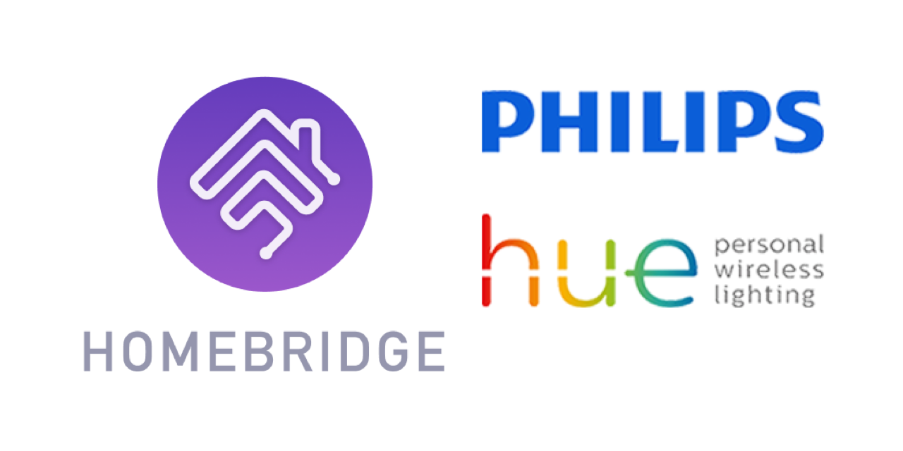

    

# Homebridge Hue2

## Homebridge plugin for Hue v2
Copyright © 2023 Erik Baauw. All rights reserved.

### Work in Progress
See [Future Development of Homebridge Hue](https://github.com/ebaauw/homebridge-hue/issues/1070).

If you have a question, please post a message to the **#hue** channel of the Homebridge community on [Discord](https://discord.gg/hZubhrz).

### Introduction
This [Homebridge](https://github.com/homebridge/homebridge) plugin exposes to Apple's [HomeKit](http://www.apple.com/ios/home/) ZigBee devices (lights, plugs, sensors, switches, ...) connected to a 2nd-generation (square) [Hue](http://www2.meethue.com/) bridge by Signify.

Note that Hue was originally developed by Philips, before they split off their Lighting division into Signify.
Signify are still using the Philips Hue brand name.
